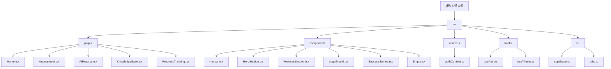

# 沟通大师 - 项目概览

**变更记录 (Changelog):**
- 2025-11-22 21:08:44 - 初始化项目架构文档，识别核心模块结构

## 项目愿景

沟通大师是一个基于 React + TypeScript 的在线沟通技巧提升平台，旨在通过个性化学习和 AI 对话练习，帮助用户提升沟通能力，改善人际关系。

## 架构总览

### 技术栈
- **前端框架**: React 18.3.1 + TypeScript 5.7.2
- **构建工具**: Vite 6.2.0
- **样式方案**: Tailwind CSS 3.4.17 + PostCSS 8.5.3
- **动画库**: Framer Motion 12.9.2
- **图表库**: Recharts 2.15.1
- **后端服务**: Supabase (可选配置)
- **状态管理**: React Context + Hooks
- **路由**: React Router DOM 7.3.0

### 项目特点
- 🎯 **个性化学习**: 根据用户评估结果提供定制化学习路径
- 🤖 **AI 对话练习**: 模拟真实场景的沟通练习，实时反馈
- 📊 **进度追踪**: 可视化学习进度和技能提升
- 🌓 **深色模式**: 完整的明暗主题支持
- 🔐 **用户认证**: 支持 Supabase 和模拟认证两种模式

## 模块结构图



## 模块索引

| 模块路径 | 职责 | 技术特点 | 关键文件 |
|---------|------|----------|----------|
| `src/pages` | 页面路由与主要功能模块 | React Router, 状态管理 | Home.tsx, AIPractice.tsx, Assessment.tsx |
| `src/components` | 可复用 UI 组件库 | Framer Motion, 响应式设计 | Navbar.tsx, HeroSection.tsx, LoginModal.tsx |
| `src/contexts` | 全局状态管理 | React Context, TypeScript 类型 | authContext.ts |
| `src/hooks` | 自定义 Hooks | React Hooks, 状态逻辑复用 | useAuth.ts, useTheme.ts |
| `src/lib` | 工具库和配置 | Supabase 集成, 工具函数 | supabase.ts, utils.ts |

## 运行与开发

### 开发环境启动
```bash
pnpm dev
```

### 构建生产版本
```bash
pnpm build
```

### 环境配置
- 复制 `.env` 文件并配置 Supabase (可选)
- 如果未配置 Supabase，系统将使用模拟数据运行

## 测试策略

### 当前状态
- **单元测试**: 暂未配置
- **集成测试**: 暂未配置
- **E2E 测试**: 暂未配置

### 建议添加
- Jest + React Testing Library 进行组件测试
- Cypress 或 Playwright 进行 E2E 测试
- Supabase 集成测试

## 编码规范

### TypeScript 规范
- 严格的类型定义，所有组件和函数都有明确的类型
- 使用接口定义数据结构，如 `User`, `Message`, `Scenario` 等
- 泛型使用恰当，保证类型安全

### 代码组织
- 按功能模块组织代码，而非按文件类型
- 组件采用函数式编程风格
- 使用自定义 Hooks 抽取业务逻辑

### 样式规范
- 使用 Tailwind CSS 类名，避免自定义 CSS
- 支持深色模式，使用 `useTheme` Hook
- 响应式设计，移动端优先

## AI 使用指引

### 项目结构理解
- 这是一个标准的 React 单页应用，采用模块化设计
- 主要功能集中在 `pages` 目录，每个页面对应一个核心功能
- 组件库在 `components` 目录，可复用性强

### 开发建议
1. **新增页面**: 在 `src/pages` 目录创建新组件，并在 `App.tsx` 中添加路由
2. **新增组件**: 在 `src/components` 目录创建，遵循现有命名规范
3. **状态管理**: 优先使用 React Context，复杂状态考虑使用状态管理库
4. **样式开发**: 使用 Tailwind CSS 类名，保持设计一致性

### 修改注意事项
- 修改 `authContext.ts` 时注意保持向后兼容性
- 添加新页面时记得更新 `Navbar.tsx` 中的导航链接
- 修改主题相关代码时确保深色模式正常工作

## 变更记录 (Changelog)

- 2025-11-22 21:08:44 - 初始化项目架构文档，识别核心模块结构